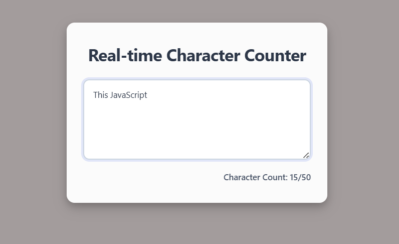
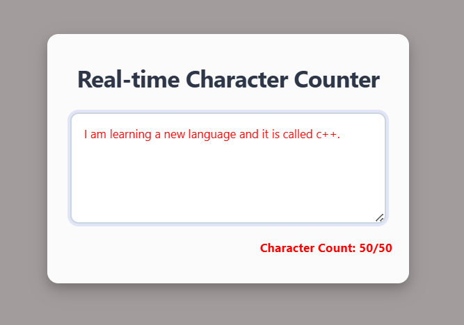

## Overview

In this one, I built a real-time character counter. The character counter displays the number of characters entered in a textarea element. The counter will update in real-time as the user types in the textarea.

